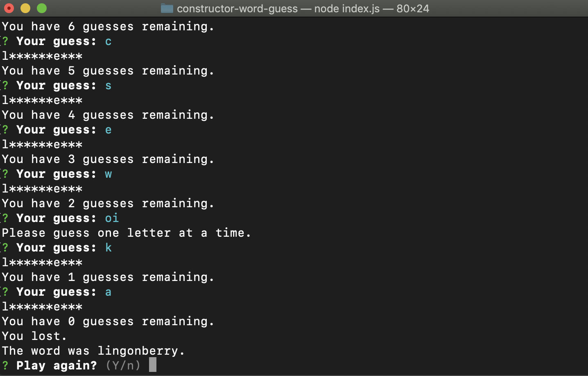

# constructor-word-guess

### Summary
Node CLI game using Javascript constructors that enables the player to enter guesses for letters in a randomly selected word. Utilizes inquirer to accept user input.

### Getting started
* Clone this repository to the directory of your choice
* Run ` npm install `
* Run ` node index `

### Playing the game
* Player guesses a letter that they think might be in the word.
* The game will reprint the word - if guessed correctly, the letter will appear.
* Each guess (even a correct one) counts towards remaining guesses. At the start of the game, this is 15.
* If letters remain to be guessed by the time all guesses are used, the word will be displayed and the player notified that they lost.
* If all letters are correctly guessed, the player is notified that they won.

### Screenshots

Guessing letters

Player lost

Player won

